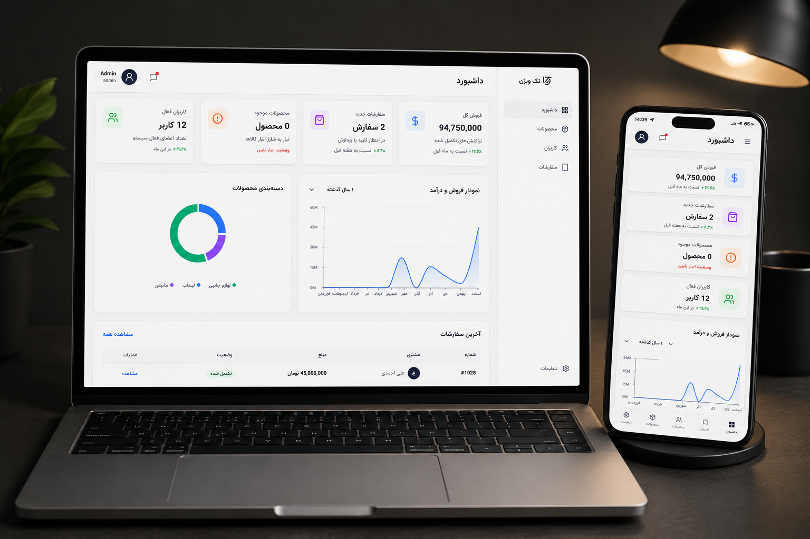

<div align="center">


# 🖥️ TechVision Admin Panel

**A full-featured admin dashboard built with the latest React 19 ecosystem.**  
Manage users, products, and orders — with real-time charts, protected routing, and validated forms.

[🚀 Live Demo](https://mahdi-delta.github.io/TechVision-AdminPanel/) · [📁 Repository](https://github.com/mahdi-delta/TechVision-AdminPanel) · [🐛 Report Bug](https://github.com/mahdi-delta/TechVision-AdminPanel/issues)

</div>

---

### panel email : admin@techvision.com
### panel password : 123456
### << and you can also use fast login button>>


---

## Preview



---

## Features

### Dashboard

- **KPI Cards** — Real-time summary stats for users, products, revenue, and orders
- **Interactive Charts** — Dynamic line and bar charts powered by **Recharts**
- **Data Visualization** — Clean, responsive chart layouts with live data updates

### User Management

- **Full CRUD** — Create, read, update, and delete users
- **Sortable & Filterable Table** — Sort by any column, search/filter in real time
- **Add / Edit User Forms** — Schema-validated forms with Formik + Yup

### Product Management

- **Product Catalog** — Browse, add, edit, and remove products
- **Live Table Updates** — Changes reflect instantly without page reload
- **Image & Price Handling** — Manage product details with structured form inputs

### Order Management

- **Order Tracking** — Full order list with status indicators
- **Status Control** — Update order status (Pending / Processing / Delivered / Cancelled)
- **Sortable Orders Table** — Filter and sort by status, date, or customer

### Authentication & Routing

- **Login Page** — JWT-ready auth flow with form validation
- **Protected Routes** — Unauthenticated users are redirected to `/login`
- **Auth Guard** — Route-level protection via a reusable `ProtectedRoute` component

### Settings

- **App-wide Config Panel** — Manage global application settings
- **Persistent Preferences** — Settings handled cleanly via Zustand global store

### UI & Developer Experience

- **Fully Responsive** — Mobile-first design, works on all screen sizes
- **Reusable Components** — Shared Sidebar, Navbar, Table, Modal, and more
- **Custom Hooks** — Encapsulated logic for clean, readable page components
- **Global State (No Prop Drilling)** — Clean state management via **Zustand**
- **Form Validation** — All forms use **Formik** for state + **Yup** for schema validation
- **Icon Library** — Consistent iconography via **Lucide React**

---

##  Tech Stack

| Category             | Technology       | Version         |
| -------------------- | ---------------- | --------------- |
| **Framework**        | React            | ^19.2.0         |
| **Build Tool**       | Vite             | ^7.3.1          |
| **Styling**          | Tailwind CSS     | ^4.2.0          |
| **Routing**          | React Router DOM | ^7.13.1         |
| **State Management** | Zustand          | ^5.0.14         |
| **Charts**           | Recharts         | ^3.8.1          |
| **Forms**            | Formik + Yup     | ^2.4.9 / ^1.7.1 |
| **Icons**            | Lucide React     | ^1.17.0         |

---

##  Project Structure

```
TechVision-AdminPanel/
├── public/
│   └── assets/                  # Static images & icons
├── src/
│   ├── components/              # Shared UI components (Sidebar, Navbar, Table, Modal, ...)
│   ├── pages/
│   │   ├── Dashboard/           # KPI cards, Recharts line/bar charts, summary stats
│   │   ├── Users/               # User list with add/edit/delete (CRUD)
│   │   ├── Products/            # Product catalog management (CRUD)
│   │   ├── Orders/              # Order tracking & status control
│   │   ├── Settings/            # App-wide configuration panel
│   │   └── Login/               # Auth page with JWT-ready flow
│   ├── store/                   # Zustand global state stores
│   ├── routes/                  # Route definitions & ProtectedRoute guard
│   ├── hooks/                   # Custom React hooks
│   └── main.jsx                 # App entry point
├── index.html
├── vite.config.js
├── eslint.config.js
└── package.json
```

---

##  Getting Started

### Prerequisites

- **Node.js** >= 18.x
- **npm** >= 9.x

### Installation

```bash
# 1. Clone the repository
git clone https://github.com/mahdi-delta/TechVision-AdminPanel.git

# 2. Navigate into the project
cd TechVision-AdminPanel

# 3. Install dependencies
npm install

# 4. Start the development server
npm run dev
```

Open [http://localhost:5173](http://localhost:5173) in your browser.

---

##  Authentication Flow

The app uses a JWT-ready login flow with Zustand for auth state management. On login, the user's session is stored in the global store. All pages except `/login` are wrapped in a `ProtectedRoute` component that checks for a valid session before rendering — unauthenticated users are redirected automatically.

---

##  Form Validation

Every form in the app is built with **Formik** for state handling and **Yup** for schema-based validation — covering required fields, email format, password strength, numeric ranges, and more.

---

##  Pages Overview

| Page      | Route        | Description                                     |
| --------- | ------------ | ----------------------------------------------- |
| Login     | `/login`     | Auth page with Formik + Yup validation          |
| Dashboard | `/dashboard` | KPI cards + Recharts line/bar charts            |
| Users     | `/users`     | Sortable/filterable table with full CRUD        |
| Products  | `/products`  | Product catalog with add/edit/delete operations |
| Orders    | `/orders`    | Order list with status management and filtering |
| Settings  | `/settings`  | App-wide configuration panel                    |

---

##  State Management

Global state is handled entirely by **Zustand**, split into focused stores per domain (auth, users, products, orders). This eliminates prop drilling and keeps component logic clean and readable.


---

##  Responsive Design

The layout is fully responsive using **Tailwind CSS v4** with a mobile-first approach. The sidebar collapses on smaller screens, tables scroll horizontally, and forms stack gracefully across all breakpoints.

---

##  License

Distributed under the [MIT License](./LICENSE).

---

<div align="center">

Made by [Mahdi-delta](https://github.com/mahdi-delta)

⭐ If you found this project useful, give it a star!

</div>
